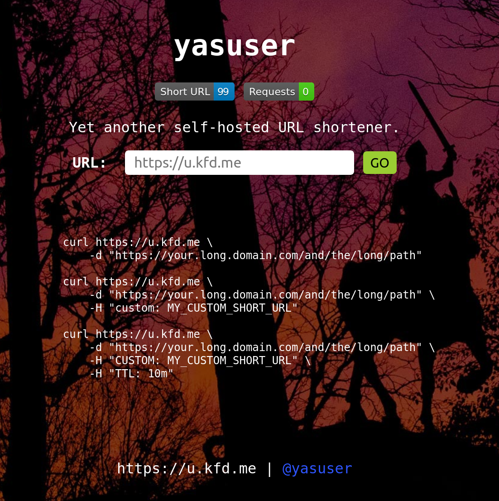

# Yasuser

> Yet another self-hosted URL shortener.

*Short* or *Restore* your URL, like <https://git.io/> or <https://goo.gl/>
but under **YOUR** control.

[](https://travis-ci.org/wrfly/yasuser)
[](https://goreportcard.com/report/github.com/wrfly/yasuser)
[](https://github.com/wrfly/yasuser/blob/master/LICENSE)
[](https://hub.docker.com/r/wrfly/yasuser/)

## Run

```sh
docker run --name yasuser -dti \
    -p 8084:8084 \
    -e YASUSER_SHORTENER_STORE_DBPATH=/data/yasuser.db \
    -e YASUSER_SERVER_DOMAIN=http://localhost:8084 \
    -v `pwd`:/data \
    wrfly/yasuser
```

Or use the [docker-compose.yml](./docker-compose.yml).

Configuration example (`./yasuser -e`):

```yaml
debug: false # log-level: debug
shortener:
  store:
    dbpath: ./yasuser.db # bolt db path, required when dbtype is bolt
    dbtype: bolt         # bolt or redis
    redis: redis://localhost:6379 # redis address, required when dbtype is redis
server:
  domain: https://u.kfd.me
  port: 8084        # port to listen
  limit: 10         # rate limit (request per second)
  pprof: false      # enable|disable pprof
                    # go tool pprof http://localhost:8084/debug/pprof/heap
  gaid: 62244864-8  # google analytics ID
```

All the configuration can be set via environment:

```txt
YASUSER_DEBUG=false
YASUSER_SHORTENER_STORE_DBPATH=./yasuser.db
YASUSER_SHORTENER_STORE_DBTYPE=bolt
YASUSER_SHORTENER_STORE_REDIS=redis://localhost:6379
YASUSER_SERVER_DOMAIN=https://u.kfd.me
YASUSER_SERVER_PORT=8084
YASUSER_SERVER_LIMIT=10
YASUSER_SERVER_PPROF=false
YASUSER_SERVER_GAID=62244864-8
```

## Usage

```bash
# short your URL
➜  ~ curl https://u.kfd.me -d "https://kfd.me"
https://u.kfd.me/1C
➜  ~

# restore it
➜  ~ curl https://u.kfd.me/1C
<a href="https://kfd.me">Found</a>.

# customize the short URL
➜  ~ curl https://u.kfd.me/ -d "https://kfd.me/hello" -H "custom: kfd"  
https://u.kfd.me/kfd

# conflict
➜  ~ curl https://u.kfd.me/ -d "https://kfd.me/world" -H "custom: kfd"
custom URL already exist

# restore the customized URL
➜  ~ curl https://u.kfd.me/kfd
<a href="https://kfd.me/hello">Found</a>.

# set TTL for a URL; bolt db will tell you the URL is expired while
# the redis will just delete it
➜  ~ curl https://u.kfd.me/ -d "https://kfd.me/kfd" -H "ttl: 1s"
https://u.kfd.me/1B
➜  ~ sleep 1 && curl https://u.kfd.me/1B
url expired

# set TTL for a customized URL
➜  ~ curl https://u.kfd.me/ -d "https://kfd.me/kfd" -H "ttl: 1s" -H "custom: 666"
https://u.kfd.me/666
➜  ~ sleep 1 && curl https://u.kfd.me/666
url expired
```

Or just visit the web page:



## Benckmark

See [benchmark](benchmark/readme.md)

## Features

- [x] it works
- [x] blob database
- [x] length and validate
- [x] memory cache
- [x] redis database
- [x] customization
- [x] TTL of URL
- [x] rate limit
- [ ] management(auth)
  - [ ] remove(domain or keywords)
  - [ ] blacklist(domain or keywords)
  - [ ] whitelist(domain or keywords)
- [ ] statistic
  - [ ] URL status
  - [ ] runtime metrics
- [x] UI index
  - [x] google analytics
  - [ ] prettify the index
- [x] pprof
